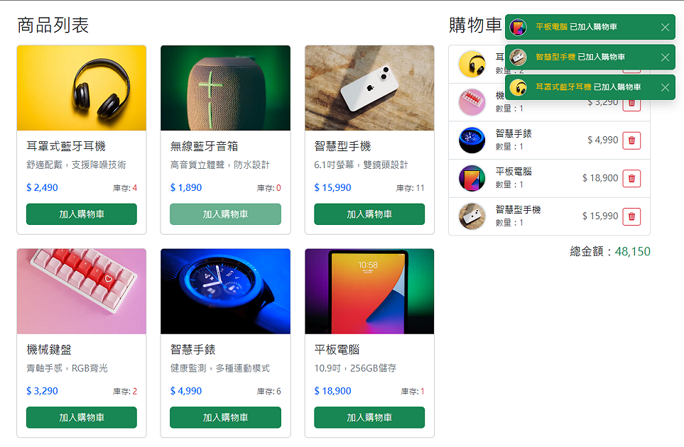
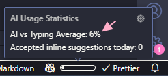
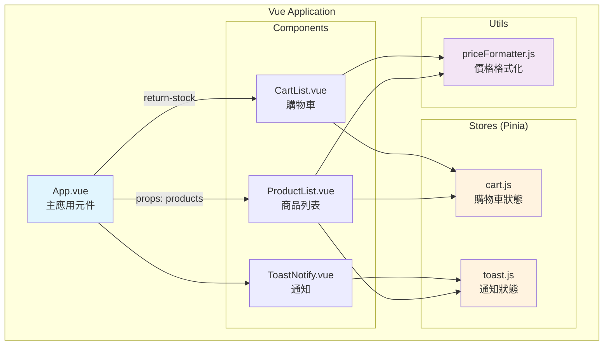
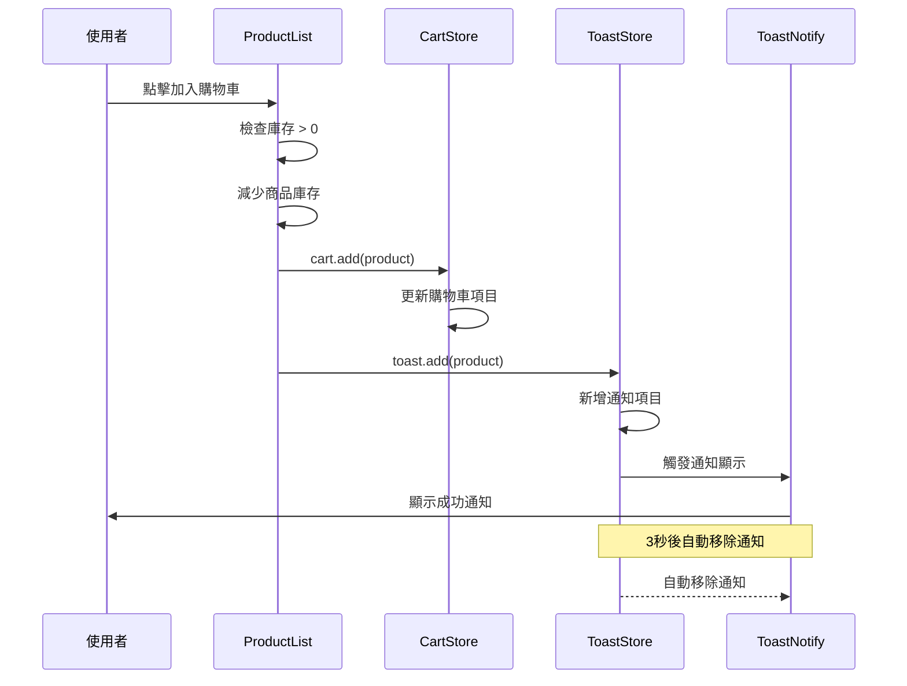
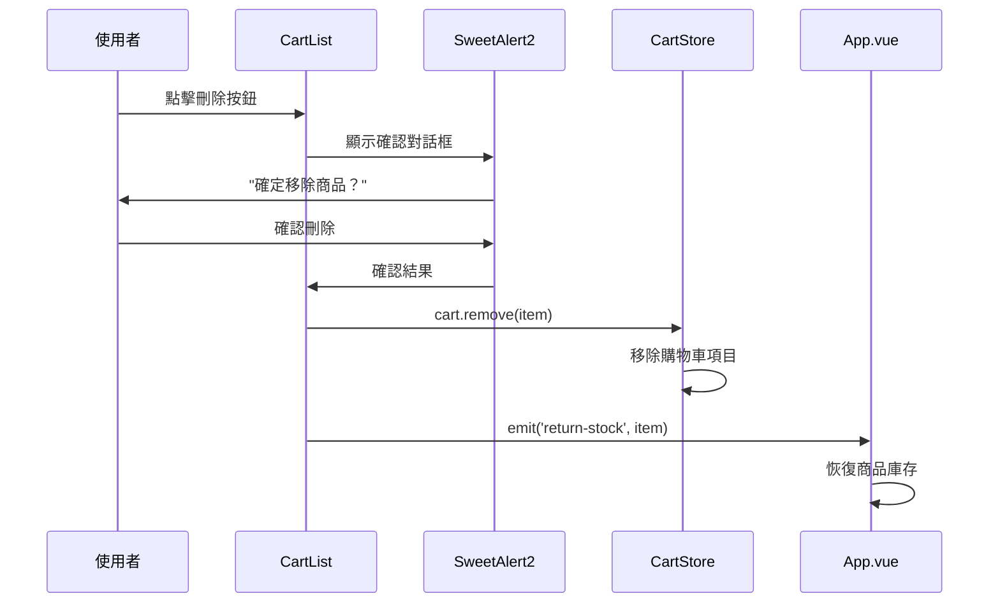
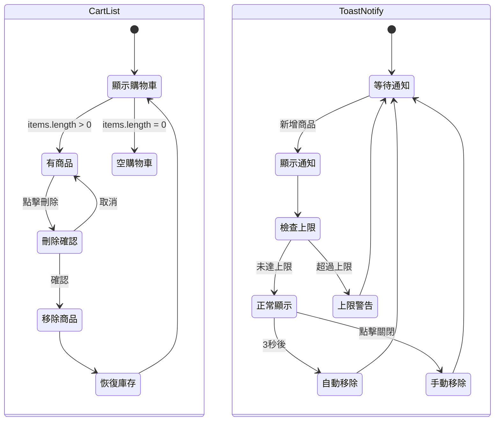
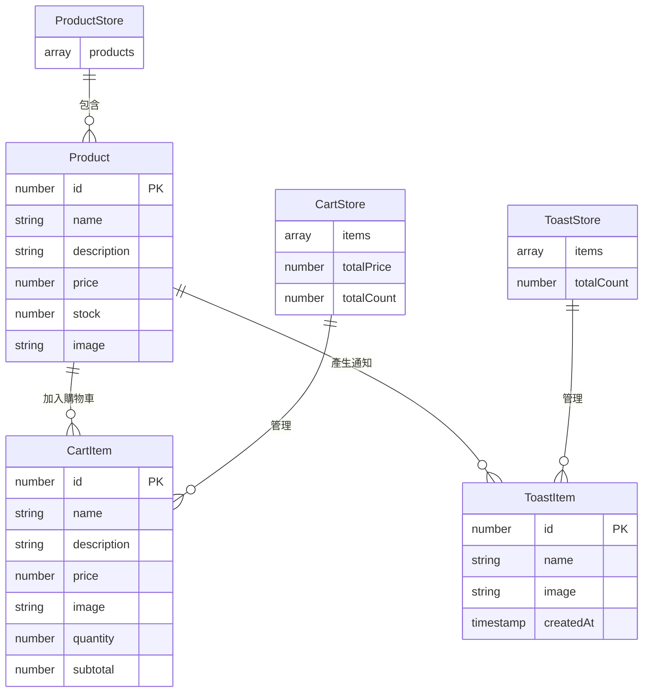

# ✡️HexVueAdvTask



> [!IMPORTANT]
> 上圖為成品，線上 Live Demo 請至 https://dpi627.github.io/HexVueAdvTask/

# 🎯任務描述

進階任務 - 元件拆分與資料傳遞

# 📜需求功能描述

- 請嘗試將「商品列表」、「購物車」、「通知」拆分成 3 個元件
- 請使用 props 將商品資料傳遞至「商品列表」元件
- 「購物車」元件的刪除功能，請使用 emit 傳遞事件
- 使用 provide, inject 完成通知功能

# 📋前置作業

- 參考[基本版型](https://codepen.io/hexschool/pen/EaVwgmK)，導入相關樣式
- 檢索[開源圖資](https://unsplash.com/)，蒐集產品圖片
- 製作測試產品資料

<details>
<summary>🗃️測試資料(JSON)</summary>

```json
[
  {
    "id": 1,
    "name": "耳罩式藍牙耳機",
    "description": "舒適配戴，支援降噪技術",
    "price": 2490,
    "stock": 6,
    "image": "https://images.unsplash.com/photo-1505740420928-5e560c06d30e?w=500&auto=format&fit=crop&q=60&ixlib=rb-4.1.0&ixid=M3wxMjA3fDB8MHxzZWFyY2h8Mnx8ZWFycGhvbmV8ZW58MHx8MHx8fDA%3D"
  },
  {
    "id": 2,
    "name": "無線藍牙音箱",
    "description": "高音質立體聲，防水設計",
    "price": 1890,
    "stock": 0,
    "image": "https://images.unsplash.com/photo-1560701814-de5e72b8d346?w=500&auto=format&fit=crop&q=60&ixlib=rb-4.1.0&ixid=M3wxMjA3fDB8MHxzZWFyY2h8Nnx8cG9ydGFibGUlMjBzcGVha2VyJTIwZ3JlZW58ZW58MHx8MHx8fDA%3D"
  },
  {
    "id": 3,
    "name": "智慧型手機",
    "description": "6.1吋螢幕，雙鏡頭設計",
    "price": 15990,
    "stock": 12,
    "image": "https://images.unsplash.com/photo-1648962495517-8398a95fe12f?w=500&auto=format&fit=crop&q=60&ixlib=rb-4.1.0&ixid=M3wxMjA3fDB8MHxzZWFyY2h8MTA3fHxjZWxsJTIwcGhvbmV8ZW58MHx8MHx8fDA%3D"
  },
  {
    "id": 4,
    "name": "機械鍵盤",
    "description": "青軸手感，RGB背光",
    "price": 3290,
    "stock": 3,
    "image": "https://plus.unsplash.com/premium_photo-1685312182226-20af33367686?w=500&auto=format&fit=crop&q=60&ixlib=rb-4.1.0&ixid=M3wxMjA3fDB8MHxzZWFyY2h8Mjl8fGtleWJvYXJkfGVufDB8fDB8fHww"
  },
  {
    "id": 5,
    "name": "智慧手錶",
    "description": "健康監測，多種運動模式",
    "price": 4990,
    "stock": 7,
    "image": "https://images.unsplash.com/photo-1557438159-51eec7a6c9e8?w=500&auto=format&fit=crop&q=60&ixlib=rb-4.1.0&ixid=M3wxMjA3fDB8MHxzZWFyY2h8MTR8fHNtYXJ0JTIwd2F0Y2h8ZW58MHx8MHx8fDA%3D"
  },
  {
    "id": 6,
    "name": "平板電腦",
    "description": "10.9吋，256GB儲存",
    "price": 18900,
    "stock": 2,
    "image": "https://images.unsplash.com/photo-1628591459313-a64214c5bfac?w=500&auto=format&fit=crop&q=60&ixlib=rb-4.1.0&ixid=M3wxMjA3fDB8MHxzZWFyY2h8NTF8fHRhYmxldHxlbnwwfHwwfHx8MA%3D%3D"
  }
]
```

</details>

# 🎉完成項目

- [x] 將「商品列表」、「購物車」、「通知」拆分成 3 個元件
- [x] 使用 props 將商品資料傳遞至「商品列表」元件
- [x] 「購物車」元件的刪除功能使用 emit 傳遞事件
- [ ] 使用 provide, inject 完成通知功能

> [!NOTE]
>
> - 購物車刪除功能未完整使用 `emit`，但其中的「恢復庫存」有
> - provide 與 inject 課程未提及，改用 `Pinia` 處理

# 🚀額外完成

| 項目              | 說明                                   |
| ----------------- | -------------------------------------- |
| 🍍 Pinia 狀態管理 | 建立元件 `cart.js` 與 `toast.js`       |
| 📭 空資料提示     | 當商品清單或購物車沒有資料時，顯示提示 |
| 📦 庫存顯示邏輯   | 低於 5 顯示紅色，0 無法加入購物車      |
| ♻️ 庫存恢復功能   | 刪除購物車商品時恢復庫存 ( `emit`)     |
| 🖼️ 縮圖顯示       | 購物車和通知顯示商品圖片               |
| 🕝 通知自動移除   | 通知預設 3 秒後自動移除                |
| 💬 通知上限       | 避免連續通知過多造成干擾 ( `props`)    |
| 📱 SweetAlert2    | 購物車刪除確認提示                     |
| 💰 價格千分位     | 於 `utils` 建立通用函示                |

# ✨關鍵檔案

```sh
src/
├── App.vue                 # 主應用元件，整合商品列表與購物車
├── main.js                 # 應用程式入口，配置 Pinia
├── components/             # Vue 元件目錄
│   ├── CartList.vue        # 購物車元件 (支援 emit 事件)
│   ├── ProductList.vue     # 商品列表元件 (接收 props)
│   └── ToastNotify.vue     # 通知元件 (支援上限設定)
├── stores/                 # Pinia 狀態管理目錄
│   ├── cart.js             # 購物車狀態管理
│   └── toast.js            # 通知狀態管理
└── utils/                  # 通用工具函數目錄
    └── priceFormatter.js   # 價格千分位格式化函數
```

# 🤖AI 輔助



- AI 介入成分低，上圖是 8/20 資訊，24 小時重置
- 開發期間關閉自動完成改人工撰寫，希望獲取更好學習成效
- AI 主要用於生成 commit message 與以下圖表製作，非任務主軸要求

## 元件關係圖



## 加入購物車流程



## 刪除購物車商品流程



## Pinia 元件狀態



## 資料結構圖



# 📚Resource

- Pinia: https://pinia.vuejs.org/zh/
- SweetAlert: https://sweetalert2.github.io/
